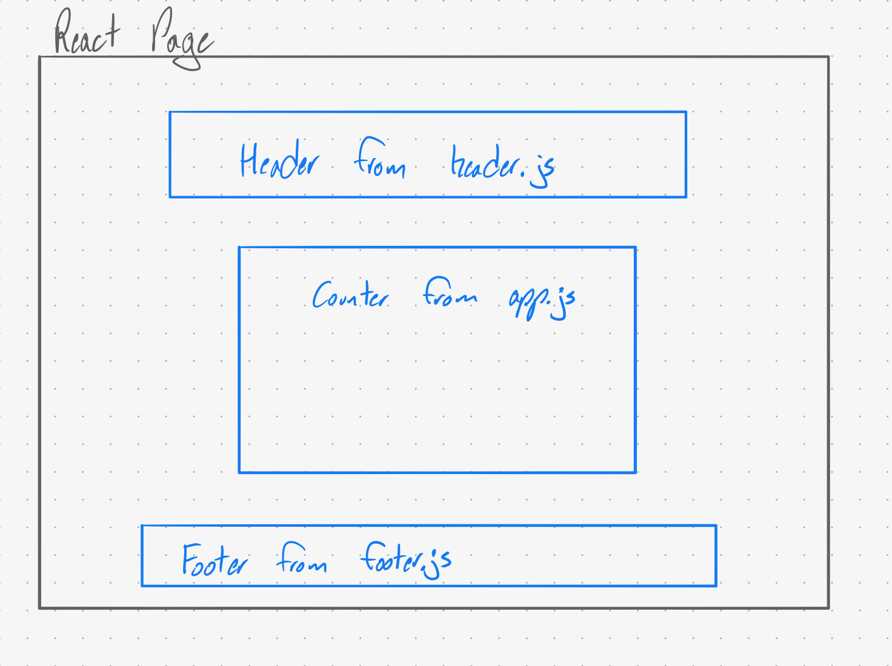

 LAB 26
=================================================

## Component Based UI

### Author: Jagdeep Singh

### Links and Resources
* [submission PR](https://github.com/401-advanced-javascript-js/lab-26-component-based-ui/pull/1)

### Modules
#### `header.js` -> react component
#### `logger.js` -> react component
#### `app.js` -> react component

#### Running the app
* `npm start`
  
#### Tests
* no tests currently

#### UML

